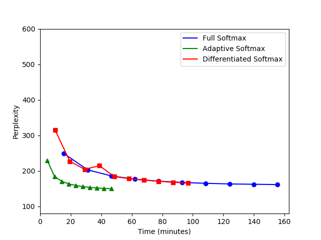

# Adaptive Softmax for Keras

Keras implementations (requiring TensorFlow backend) of Adaptive Softmax<sup>[1](#efficient-softmax-approximation-for-gpus)</sup> and a variation of Differentiated Softmax<sup>[1](#efficient-softmax-approximation-for-gpus),[2](#strategies-for-training-large-vocabulary-neural-language-models)</sup>. These alternatives to standard softmax exploit differences in word frequencies to substantially reduce neural language model training time.

## Installation

### General Use

Run the following, ideally from a virtualenv:

```
pip install git+https://github.com/johntrimble/adaptive-softmax-keras.git#egg=adaptive-softmax-keras
```

### Development

Run the following, ideally from a virtualenv:

```
git clone https://github.com/johntrimble/adaptive-softmax-keras.git
cd adaptive-softmax-keras
pip install --requirement requirements.txt
pip install --editable .
```

## Performance Comparison



The above compares perplexity over time for full, adaptive, and differentiated softmax on the [text8](http://mattmahoney.net/dc/textdata.html) dataset over 10 training iterations. Each point represents a completed epoch. Note that adaptive softmax takes less than half the training time of full softmax to achieve the same perplexity score. See [examples/text8_benchmark.py](examples/text8_benchmark.py) for further details.

## References

1. <span id="efficient-softmax-approximation-for-gpus">Edouard Grave, Armand Joulin, Moustapha Cissé, David Grangier, Hervé Jégou, _[Efficient softmax approximation for GPUs](https://arxiv.org/abs/1609.04309)_</span>

2. <span id="strategies-for-training-large-vocabulary-neural-language-models">Welin Chen, David Grangier, Michael Auli, _[Strategies for Training Large Vocabulary Neural Language Models](https://arxiv.org/abs/1512.04906)_</span>
